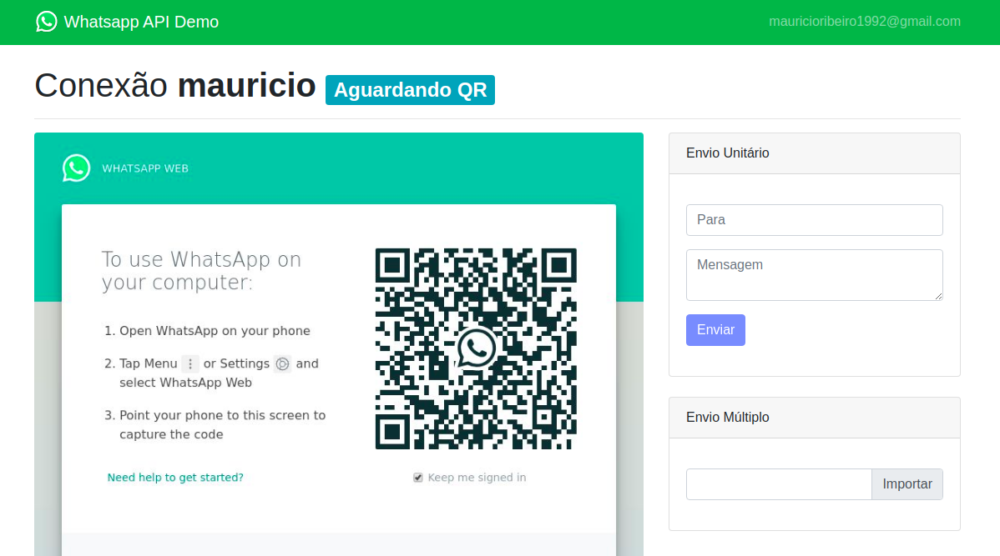

# Whatsapp-WEB

### About
This project is only a web demo application in Flask + AngularJS 
to connect to [Whatsapp Private API](https://github.com/mauricioribeiro/Whatsapp-API).

### Features
 - Sends single message
 - Sends multiple messages in batch mode (from .csv file)
 - Receives messages via configured webhook
 - Receives messages via configured socket.io channel (like websocket)
 - Stores scanned device information (platform, battery level, number)
 - Stores raw data from received messages (user profile, name, number)
 - Keeps device logged even if service stops
 - Disconnects when logout from device
  
### Screenshots
Instances list

 
Waiting for QR Code

 
Connected

### Contact
If you're interested, feel free to contact me at mauricioribeiro1992@gmail.com 
